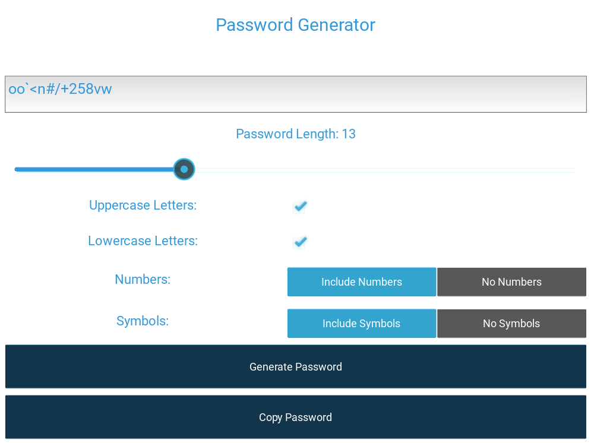

# Password Generator App V-1.0

This is a simple password generator application built using Python and the Kivy framework. It allows users to generate random passwords with customizable options such as length, character types, and symbols.

## Features

- Generate random passwords with customizable options.
- Set the length of the password (between 10 to 20 characters).
- Include or exclude uppercase and lowercase letters.
- Include or exclude numbers.
- Include or exclude symbols.
- Copy generated password to clipboard.

## Installation

1. Clone the repository to your local machine:

   ```bash
   git clone https://github.com/ultronpatil/password-generator.git
   ```

2. Navigate to the project directory:

   ```bash
   cd mob-app-password
   ```

3. Install the required dependencies:

   ```bash
   pip install -r requirements.txt
   ```

## Usage

1. Run the application:

   ```bash
   python main.py
   ```

2. Set the desired options for the password generation.
3. Click on the "Generate Password" button to generate a random password.
4. Optionally, click on the "Copy Password" button to copy the generated password to the clipboard.

## Screenshots



## Terminal Password Generator

### Features

- Generate random passwords with customizable options.
- Set the length of the password (between 8 to 16 characters).
- Include or exclude uppercase and lowercase letters.
- Include or exclude numbers.
- Include or exclude special symbols.

### Usage

1. Run the Python script:

   ```bash
   python terminal_password_generator.py
   ```

2. Follow the prompts to set the desired options for the password generation.
3. The generated password will be displayed in the terminal.

## Contributing

Contributions are welcome! If you'd like to contribute to this project, please fork the repository and submit a pull request.
